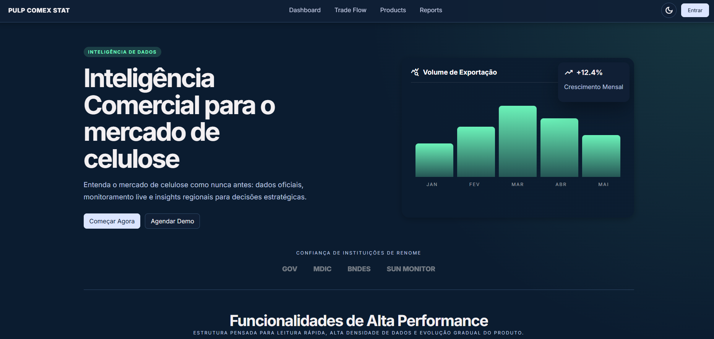
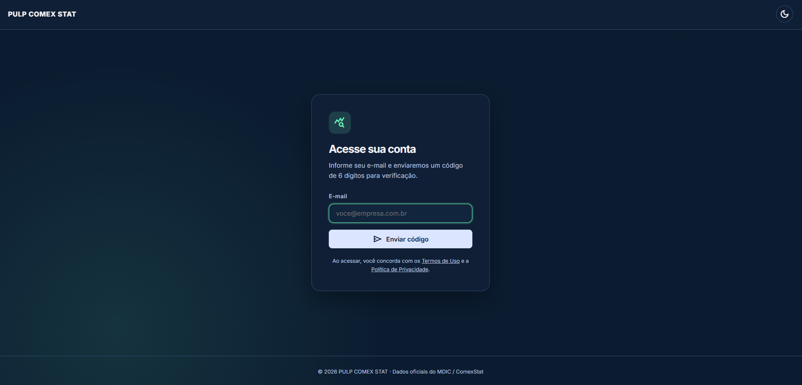
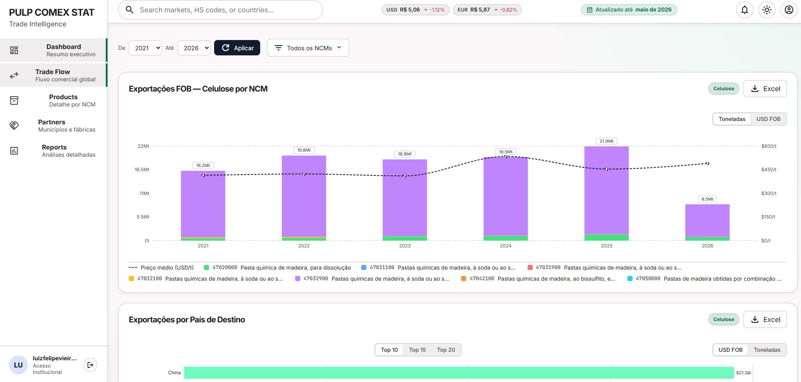
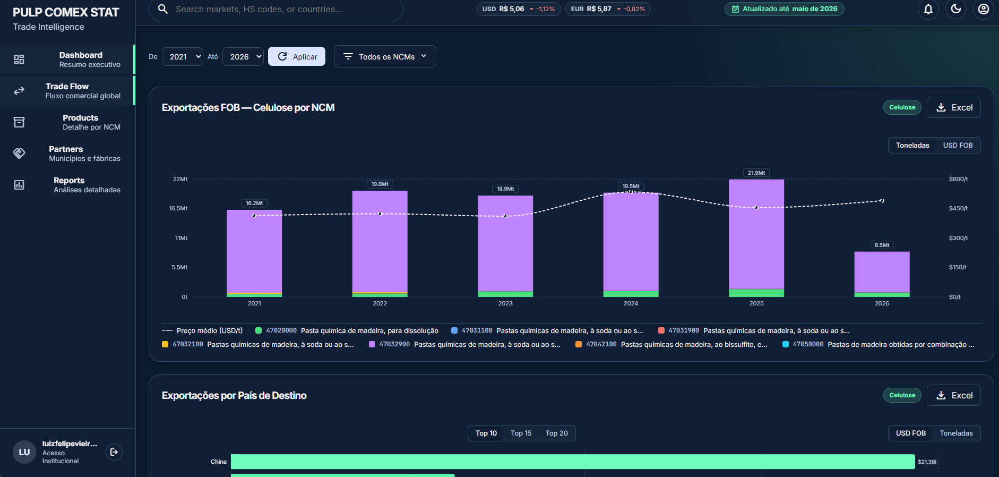

# PULP COMEX STAT

PULP COMEX STAT é um projeto real, desenvolvido sob demanda para um cliente real, com o objetivo de fornecer inteligência de mercado para o setor de celulose.

O produto transforma dados oficiais em informação acionável e organiza a experiência entre apresentação institucional, autenticação, dashboard e relatórios analíticos.

## Principais features

- Integração com a base de dados do Siscomex para leitura de comércio exterior.
- Integração com a AwesomeAPI, fornecedora da cotação de moeda usada no projeto.
- Visão consolidada de exportações, NCM e recortes regionais.
- Dashboard com filtros, indicadores e relatórios para leitura executiva.
- Autenticação e navegação protegida para uso em ambiente SaaS.

## Demonstração

### Home

### Login

### Dashboard em tema claro

### Dashboard em tema escuro

## Stack

- React
- TypeScript
- Vite
- React Router
- Supabase
- Recharts
- XLSX

